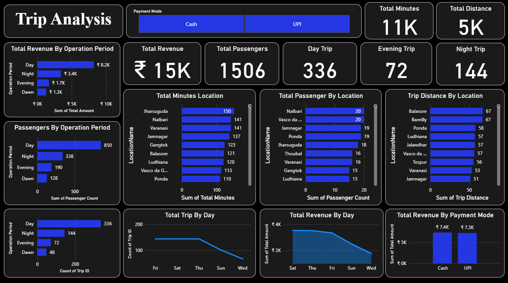

# Trip-Analysis-Dashboard (Interactive Power BI Dashboard)

## 📌 Project Objective  
To design and develop an **interactive Trip Analysis Dashboard** in Power BI that provides real-time insights into revenue, passenger trends, trip performance, and operational efficiency.  
The dashboard enables stakeholders to monitor key performance indicators (KPIs), analyze trip data by time period, payment mode, and location, and make **data-driven decisions** to optimize operations.  

---

## 🚨 Business Problem  
In the transportation and travel industry, understanding trip patterns, passenger behavior, and revenue distribution is critical for improving efficiency and customer experience.  

This dashboard addresses the need to:  
- Monitor **total revenue, passengers, minutes, and distance covered** across operations  
- Compare trip performance by **operation period (Day, Night, Evening, Dawn)**  
- Evaluate **payment mode preferences (Cash vs UPI)**  
- Track **location-based performance** in terms of passengers, distance, and trip time  
- Identify **daily and weekly trip trends** to optimize scheduling  
- Enable **data-driven decision-making** for better operational strategies  

---

## 📂 Dataset Used  
- [Dataset](https://github.com/KamalNayanTiwary/Trip-Analysis-Dashboard/blob/main/Trip_Data.xlsx)  

---

## ❓ Key Questions (KPIs)  
- What is the **total revenue, total passengers, total minutes, and total distance** covered?  
- How does **revenue vary by operation period** (Day/Night/Evening/Dawn)?  
- What is the **passenger distribution** across different time periods?  
- Which **locations contribute the most to trip minutes, passengers, and distance**?  
- What is the **distribution of trips across weekdays**?  
- How is **revenue distributed by day of the week**?  
- What is the **preferred payment mode** (Cash vs UPI)?  
- How many **day trips vs night trips** are being taken?  
- Which **locations show high demand** in terms of passengers and distance traveled?  

---

## ⚙️ Process  
- **Data Import & Cleaning:** Data was cleaned and prepared in Power Query (handling null values, formatting columns, standardizing data types).  
- **Data Transformation:** Applied transformations like grouping, calculated columns, and DAX measures to prepare KPIs.  
- **Data Modeling:** Built a relational data model for efficient calculation of metrics.  
- **Visualization Setup:** Designed bar charts, KPIs, and line charts to visualize trips by period, day, payment mode, and location.  
- **Dashboard Design:** Combined all visuals into an interactive, user-friendly Power BI dashboard with filters and slicers.  

---

## 📊 Dashboard  

  

---

## 🔎 Project Insights  
- **Revenue Performance:** Highest revenue is generated during **Day operations (₹8.2K)**, followed by Night (₹3.4K).  
- **Passenger Trends:** Majority of passengers (850) travel during the **Day period**, while Dawn shows the lowest count (128).  
- **Trip Counts:** Day trips (336) dominate, whereas evening trips are significantly lower (72).  
- **Payment Mode:** Revenue is nearly equally split between **Cash (₹7.4K)** and **UPI (₹7.3K)**, suggesting both modes are equally popular.  
- **Location Insights:**  
  - **Jharsuguda** records the highest trip minutes (150).  
  - **Nalbari & Vasco da Gama** have the most passengers (20 each).  
  - **Balasore & Bareilly** record the longest trip distances (67 each).  
- **Weekly Trends:** Revenue and trips decline gradually over weekdays, suggesting weekends may drive higher demand.  

---

## ✅ Final Conclusion  
- Focus on **increasing trips during Evening and Dawn periods** to balance load and revenue.  
- Encourage **UPI transactions** with small discounts to drive cashless payments.  
- Optimize resources at **high-demand locations (Jharsuguda, Nalbari, Balasore)** to meet passenger demand.  
- Increase awareness and offers for **low-demand operation periods** to boost usage.  
- Use **daily and weekly trends** for scheduling trips more effectively and maximizing utilization.  

---

## 👨‍💻 Author & Contact  
**Kamal Nayan Tiwary**  
**Data Analyst**

📧 Email: **kamalnayantiwary73@gmail.com**  
🔗 [LinkedIn](https://www.linkedin.com/in/kamal-nayan-tiwary-2022-2026-/)  
